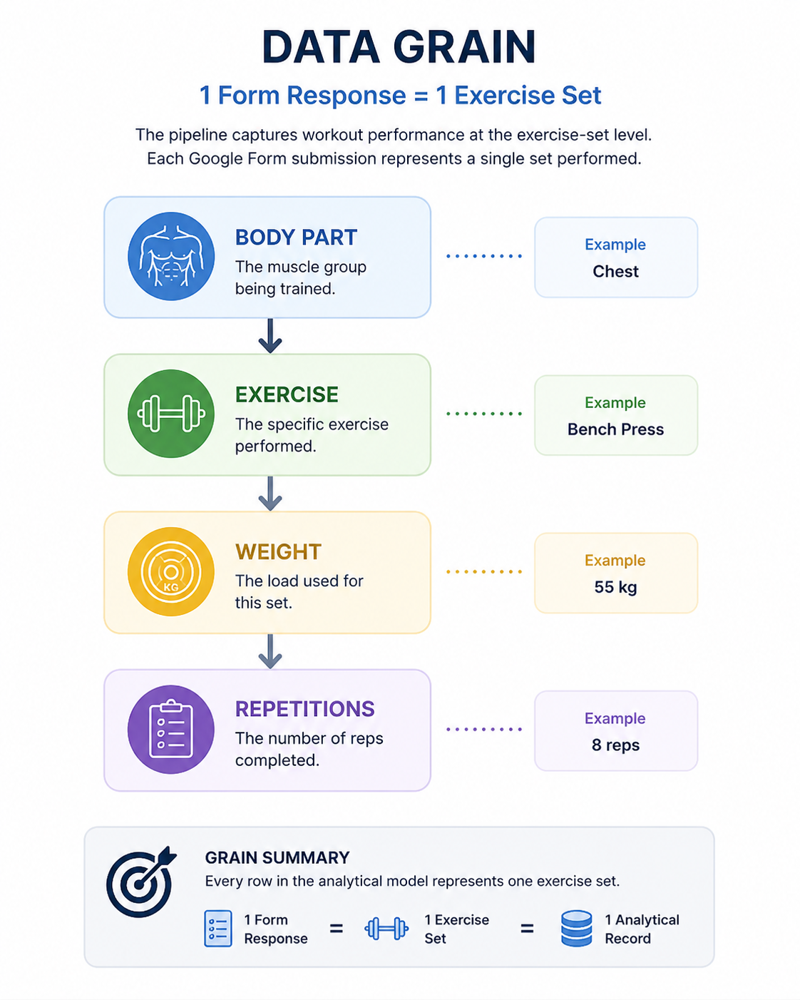
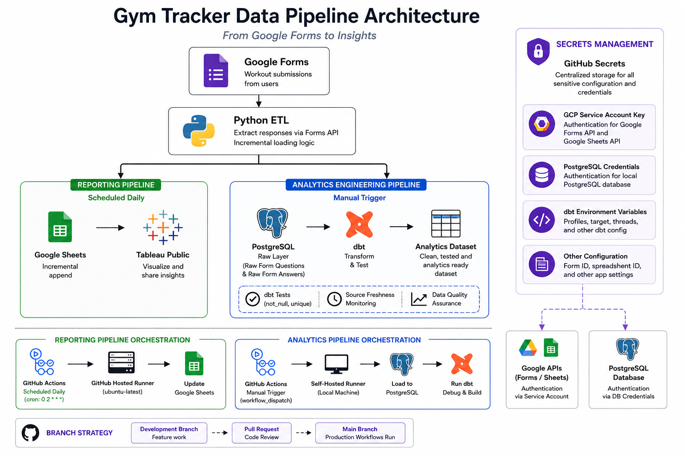
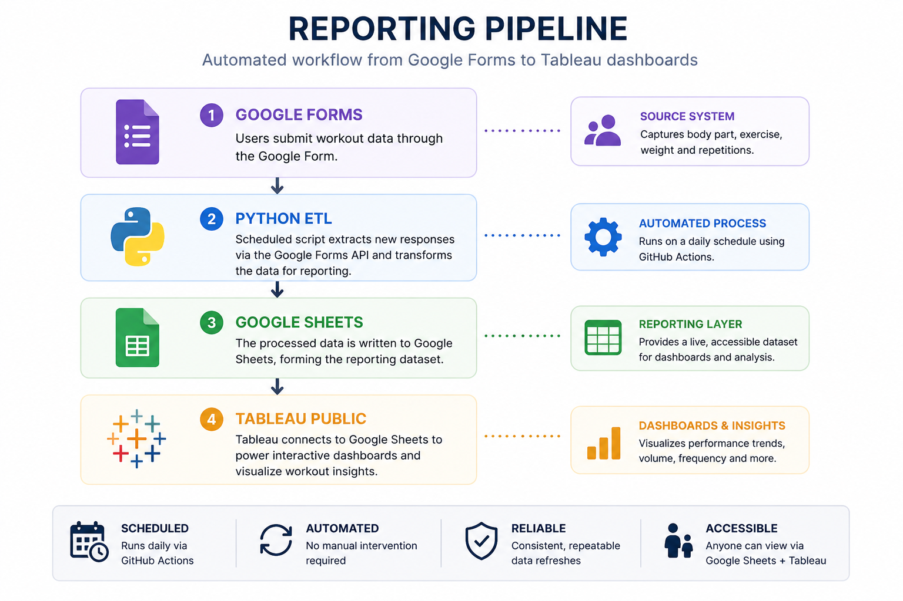
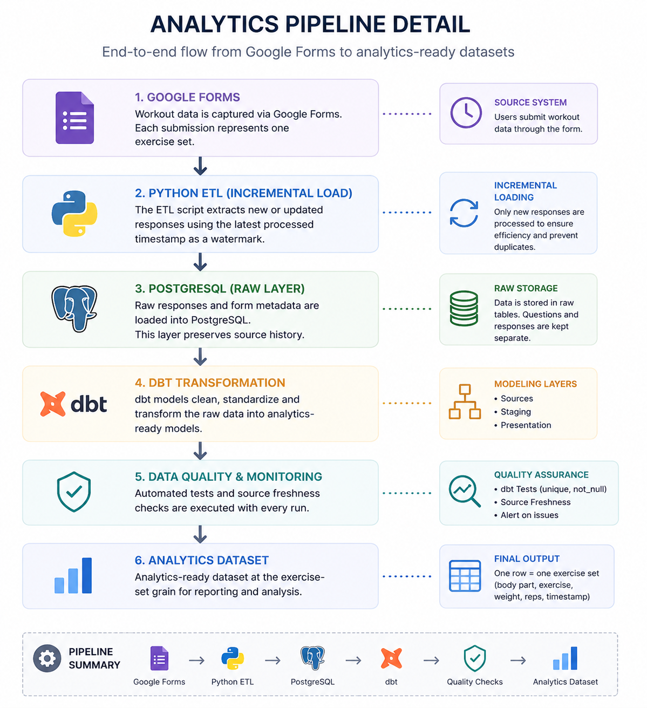

# Architecture Overview

## Purpose

This project explores two approaches to delivering analytics from Google Forms workout data:

1. A reporting pipeline that updates Google Sheets for Tableau Public.
2. An analytics engineering pipeline that loads PostgreSQL and transforms the data with dbt.

Both pipelines use the same Google Form as the source system, but they are designed for different delivery needs.

---

## Data grain

The core design decision is the grain of the data.

Each Google Form submission represents **one completed exercise set**.




[Watch Google Form workflow demo](Images/Google_form.mp4)

The form captures:

```text
Body Part → Exercise → Weight → Reps
```

Example:

| Body Part | Exercise | Weight | Reps |
|---|---|---:|---:|
| Chest | Bench Press | 55 | 6 |
| Chest | Bench Press | 55 | 7 |
| Chest | Bench Press | 55 | 8 |

This grain supports future analysis such as:

- Workout volume
- Progressive overload
- Personal bests
- Exercise trends
- Body-part level analysis
- Workout frequency

This decision informed the Google Form structure, Python extraction logic, PostgreSQL raw tables and dbt presentation model.

---

## Overall architecture



---

## Reporting pipeline



The reporting pipeline is designed for dashboard delivery.

```text
Google Forms → Python ETL → Google Sheets → Tableau Public
```

The script `Gym to google sheets.py` extracts responses from the Google Forms API, filters for the previous day of responses, flattens the response JSON, maps question IDs to question titles, pivots the answers and appends the output to Google Sheets.

Google Sheets is used as the reporting layer because Tableau Public cannot connect directly to PostgreSQL databases.

---

## Analytics engineering pipeline



The analytics engineering pipeline is designed for data modelling and quality validation.

```text
Google Forms → Python ETL → PostgreSQL → dbt → Analytics Dataset
```

The script `Gym Git.py` extracts responses and question metadata from the Google Forms API and loads them into PostgreSQL raw tables. dbt then transforms the raw JSON into a final presentation model.

---

## Raw data strategy

The raw layer separates response data from form metadata.

### `RAW_FORM_ANSWERS`

Stores historical workout responses.

This table is loaded incrementally.

### `RAW_FORM_QUESTIONS`

Stores Google Form structure and question definitions.

New question metadata is inserted on each run. dbt then keeps the latest available metadata through `Questions_filter.sql`:

```sql
SELECT questions, insert_timestamp
FROM (
    SELECT *, ROW_NUMBER() OVER (ORDER BY insert_timestamp DESC) AS rn
    FROM {{ source('raw', 'raw_form_questions') }}
)
WHERE rn = 1
```

This means response history is preserved while transformations use the current Google Form structure.

---

## Incremental loading strategy

The PostgreSQL pipeline avoids reprocessing previously loaded responses.

Before inserting new answers, `Gym Git.py` checks the latest response date already available in the presentation table:

```sql
SET search_path TO pres;

SELECT max(date(create_time))
FROM "GYM_RESPONSE";
```

The script then only keeps responses where the response creation date is greater than that watermark:

```python
if create_time > max_date:
    data.append(item)
```

This provides a simple incremental loading pattern.

Benefits:

- Reduced API processing
- Faster pipeline runs
- Lower risk of duplicate records
- Clear restart point for future runs

---

## Dynamic exercise metadata design

The Google Form was intentionally designed so exercise-selection questions contain the word `Exercises` in the question title.

The dbt model `Questions_model.sql` standardises those question titles:

```sql
CASE
    WHEN item.value->>'title' LIKE '%Exercises%'
    THEN 'Exercises'
    ELSE item.value->>'title'
END AS title
```

This allows the model to treat exercise-selection questions consistently while still allowing the form to evolve.

Exercise options are extracted from the Google Forms question metadata using PostgreSQL JSON processing:

```sql
jsonb_array_elements(
    item.value->'questionItem'->'question'->'choiceQuestion'->'options'
) AS option
```

This means new exercises can be added through the Google Form interface without hardcoding them in Python, PostgreSQL or dbt.

---

## Final analytical output

The final dbt presentation model is `GYM_UPDATE`.

It pivots answer rows into an exercise-set level dataset using conditional aggregation:

```sql
MAX(A.answer) FILTER (WHERE Q.title = 'Which body part did you work out?') AS "Body_Part",
MAX(A.answer) FILTER (WHERE Q.title = 'How heavy was the weight?') AS "Weight",
MAX(A.answer) FILTER (WHERE Q.title = 'How many reps?') AS "Reps",
MAX(A.answer) FILTER (WHERE Q.title = 'Exercises') AS "Exercises"
```

The final grain is `response_id`, where each row represents one exercise set.

---

## Design trade-offs

### Why Google Sheets for reporting?

Tableau Public cannot connect directly to PostgreSQL databases. Google Sheets provides a lightweight intermediary layer that Tableau Public can consume.

### Why separate answers and questions?

Answers are historical events. Questions represent form structure, which may change over time. Separating these concerns allows response history to be preserved while using the latest form metadata for modelling.

### Why keep question metadata every run?

The form can evolve as new exercises are added. Keeping question metadata allows the pipeline to identify the current form structure without hardcoded exercise lists.

### Why a self-hosted runner for analytics?

The PostgreSQL database is hosted locally. A self-hosted runner allows GitHub Actions to execute the analytics pipeline without exposing PostgreSQL publicly.
