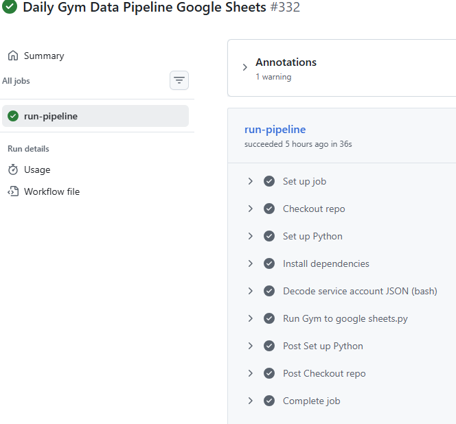
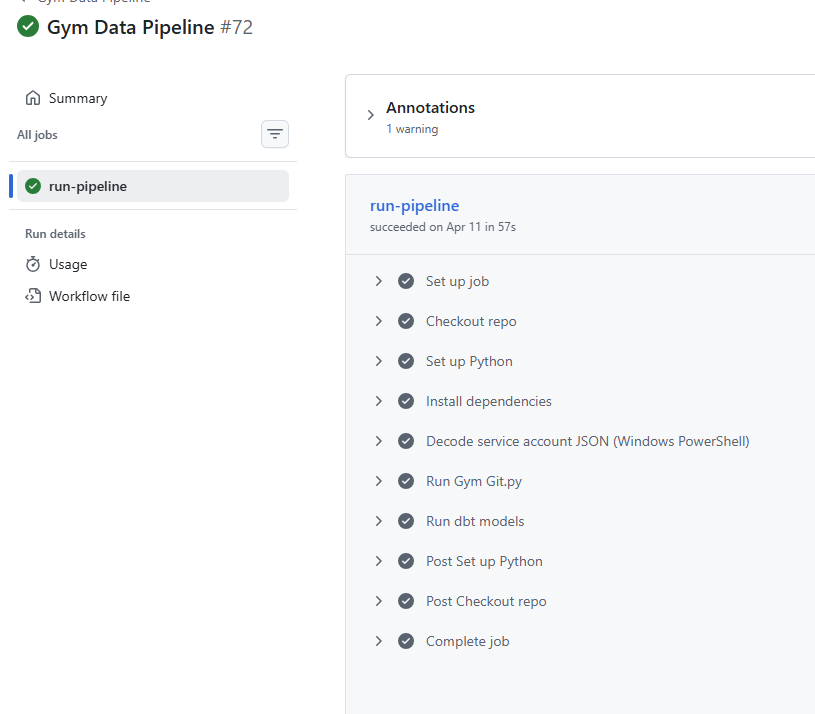

# Workflow Orchestration

## Overview

The project uses GitHub Actions for pipeline execution.

There are two workflows:

| Workflow | File | Trigger | Runner | Purpose |
|---|---|---|---|---|
| `Daily Gym Data Pipeline Google Sheets` | `.github/workflows/Google_sheet_action.yml` | Scheduled + manual | GitHub-hosted Ubuntu | Update Google Sheets |
| `Gym Data Pipeline` | `.github/workflows/actions.yml` | Manual | Self-hosted Windows | Load PostgreSQL and run dbt |

The workflows use different runner types because the two pipelines have different infrastructure requirements.

---

## Reporting workflow

### Trigger

The reporting workflow runs daily at 02:00 UTC and can also be triggered manually.

```yaml
on:
  schedule:
    - cron: '0 2 * * *'
  workflow_dispatch:
```

### Runner

```yaml
runs-on: ubuntu-latest
```

This is a GitHub-hosted Ubuntu runner.

### Purpose

The workflow updates the Google Sheets reporting layer by running:

```text
Gym to google sheets.py
```

### Workflow screenshot



### Main steps

- Checkout repository
- Set up Python
- Install dependencies from `requirements.txt`
- Decode Service Account JSON
- Run the Google Sheets pipeline script

---

## Analytics engineering workflow

### Trigger

The analytics workflow is manually triggered.

```yaml
on:
  workflow_dispatch:
```

### Runner

```yaml
runs-on: self-hosted
```

This runs on the local Windows machine configured as a GitHub Actions runner.

### Purpose

The workflow loads PostgreSQL and runs dbt:

```text
Gym Git.py
cd gym_tracker_dbt
dbt debug
dbt build
```

### Workflow screenshot



### Main steps

- Checkout repository
- Set up Python
- Install dependencies from `requirements.txt`
- Decode Service Account JSON
- Run the PostgreSQL ingestion script
- Run `dbt debug`
- Run `dbt build`

---

## Hosted vs self-hosted runner decision

The reporting pipeline can run on a GitHub-hosted runner because it only needs access to public Google APIs.

The analytics pipeline uses a self-hosted runner because PostgreSQL is hosted locally. A GitHub-hosted runner would not be able to connect to that local database unless the database was exposed publicly.

Using a self-hosted runner allows the project to automate PostgreSQL and dbt execution without opening the local database to the internet.

---

## Operational monitoring

GitHub Actions provides basic operational visibility:

- Workflow status
- Step-level logs
- Runtime duration
- Manual reruns
- Failure diagnostics
- Failure notifications to email

The workflow screenshots in this document are included to show successful execution of the automated pipelines.

---

## Future enhancements

- Containerise execution with Docker
- Add CI checks for dbt models before merge
